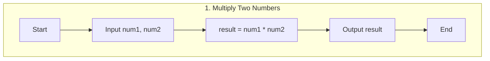
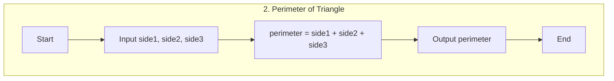
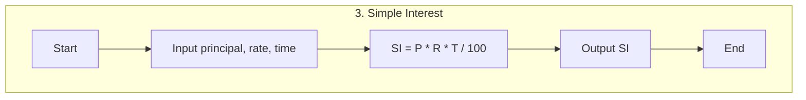
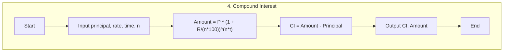
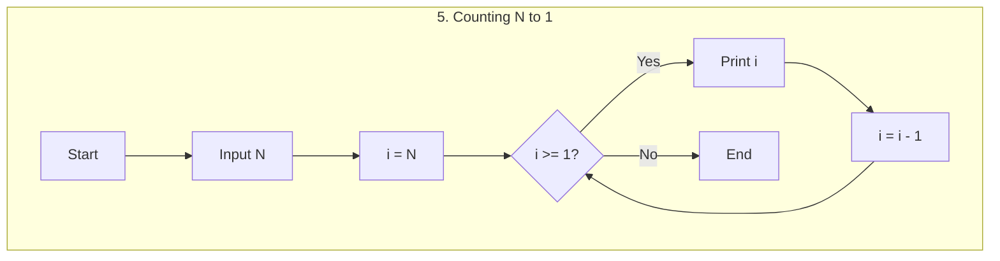
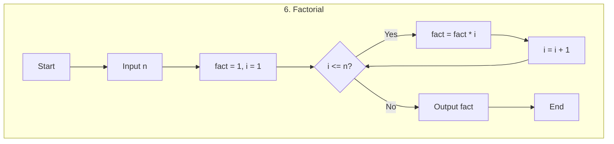
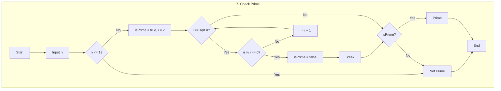
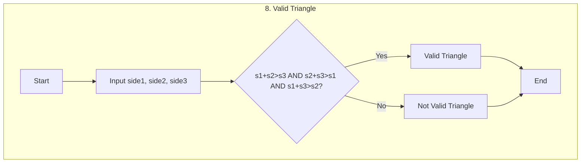
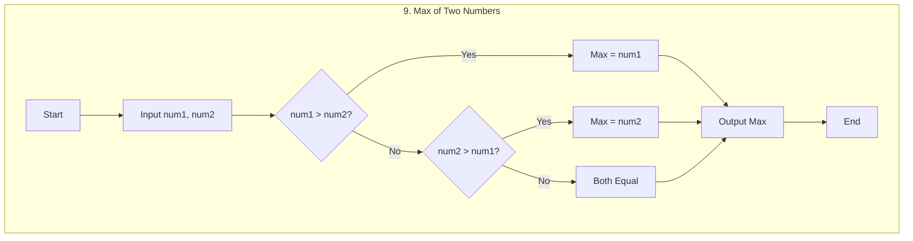

# L1 Flowcharts (Mermaid)

This repository includes nine basic programming flowcharts. Below, each flowchart is rendered in its own Mermaid block so they appear stacked vertically in the README.

## 1. Multiply Two Numbers

## 2. Perimeter of Triangle

## 3. Simple Interest

## 4. Compound Interest

## 5. Counting N to 1

## 6. Factorial

## 7. Check Prime

## 8. Valid Triangle

## 9. Max of Two Numbers

View in Browser
- For an interactive web rendering, open `flowchart.html` in your browser.