# L1 Flowcharts (Mermaid)

This repository includes a Mermaid diagram with several basic programming flowcharts.

The diagram is embedded below using a Mermaid code block. Platforms like GitHub render Mermaid directly in Markdown. If your viewer doesn't support Mermaid, open `flowchart.html` in a browser to see a web-rendered version.

```mermaid
graph TD
    subgraph "1. Multiply Two Numbers"
    A1[Start] --> B1[Input num1, num2]
    B1 --> C1[result = num1 * num2]
    C1 --> D1[Output result]
    D1 --> E1[End]
    end
    
    subgraph "2. Perimeter of Triangle"
    A2[Start] --> B2[Input side1, side2, side3]
    B2 --> C2[perimeter = side1 + side2 + side3]
    C2 --> D2[Output perimeter]
    D2 --> E2[End]
    end
    
    subgraph "3. Simple Interest"
    A3[Start] --> B3[Input principal, rate, time]
    B3 --> C3[SI = P * R * T / 100]
    C3 --> D3[Output SI]
    D3 --> E3[End]
    end
    
    subgraph "4. Compound Interest"
    A4[Start] --> B4[Input principal, rate, time, n]
    B4 --> C4["Amount = P * (1 + R/(n*100))^(n*t)"]
    C4 --> D4[CI = Amount - Principal]
    D4 --> E4[Output CI, Amount]
    E4 --> F4[End]
    end
    
    subgraph "5. Counting N to 1"
    A5[Start] --> B5[Input N]
    B5 --> C5[i = N]
    C5 --> D5{i >= 1?}
    D5 -->|Yes| E5[Print i]
    E5 --> F5[i = i - 1]
    F5 --> D5
    D5 -->|No| G5[End]
    end
    
    subgraph "6. Factorial"
    A6[Start] --> B6[Input n]
    B6 --> C6[fact = 1, i = 1]
    C6 --> D6{i <= n?}
    D6 -->|Yes| E6[fact = fact * i]
    E6 --> F6[i = i + 1]
    F6 --> D6
    D6 -->|No| G6[Output fact]
    G6 --> H6[End]
    end
    
    subgraph "7. Check Prime"
    A7[Start] --> B7[Input n]
    B7 --> C7{n <= 1?}
    C7 -->|Yes| D7[Not Prime]
    D7 --> M7[End]
    C7 -->|No| E7[isPrime = true, i = 2]
    E7 --> F7{i <= sqrt n?}
    F7 -->|Yes| G7{n % i == 0?}
    G7 -->|Yes| H7[isPrime = false]
    H7 --> I7[Break]
    I7 --> J7{isPrime?}
    G7 -->|No| K7[i = i + 1]
    K7 --> F7
    F7 -->|No| J7
    J7 -->|Yes| L7[Prime]
    J7 -->|No| D7
    L7 --> M7
    end
    
    subgraph "8. Valid Triangle"
    A8[Start] --> B8[Input side1, side2, side3]
    B8 --> C8{s1+s2>s3 AND s2+s3>s1 AND s1+s3>s2?}
    C8 -->|Yes| D8[Valid Triangle]
    C8 -->|No| E8[Not Valid Triangle]
    D8 --> F8[End]
    E8 --> F8
    end
    
    subgraph "9. Max of Two Numbers"
    A9[Start] --> B9[Input num1, num2]
    B9 --> C9{num1 > num2?}
    C9 -->|Yes| D9[Max = num1]
    C9 -->|No| E9{num2 > num1?}
    E9 -->|Yes| F9[Max = num2]
    E9 -->|No| G9[Both Equal]
    D9 --> H9[Output Max]
    F9 --> H9
    G9 --> H9
    H9 --> I9[End]
    end
```

## View in Browser

Open `flowchart.html` in your browser for an interactive web page rendering using Mermaid.js.